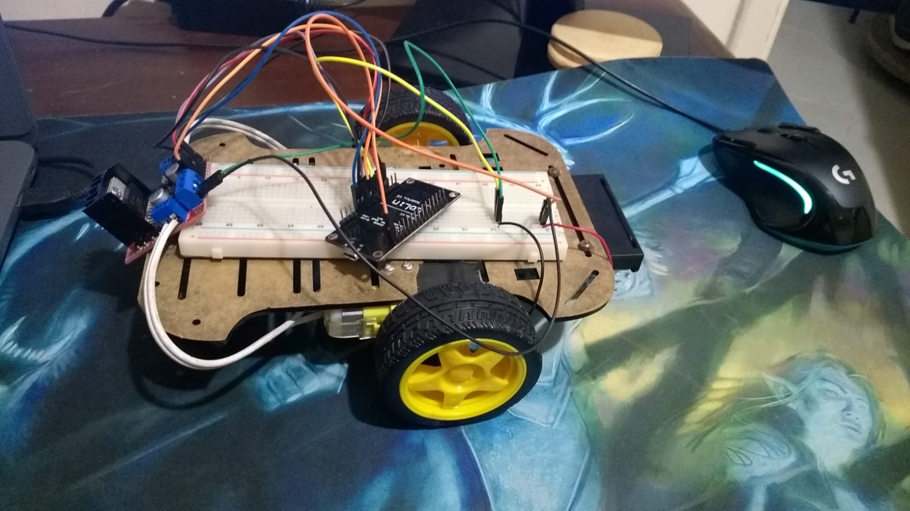
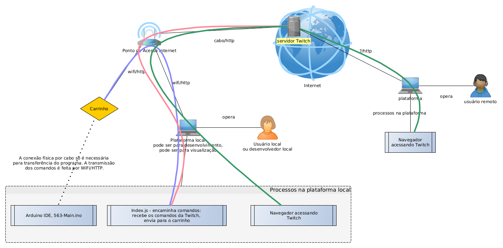

# Twitch Car

Atividade desenvolvida em 2021 na disciplina Computação Física. Este documento foi escrito após a conclusão da atividade.

## Objetivo

1. Construir um carrinho controlado através de comandos enviados pelo chat da Twitch.
2. Construir e configurar todos os programas necessários para o envio, recepção e execução dos comandos. 

## Visão geral

É possível encontrar em alguns repositórios, por exemplo [neste pinterest](https://br.pinterest.com/pin/twitch--1034631714365131958/), indicações que, em algum momento, Twitch designava-se:

> Twitch is an interactive livestreaming service for content spanning gaming, entertainment, sports, music, and more. There’s something for everyone on Twitch.

Twitch permite que extensões sejam escritas usando sua API. Mais informação em https://dev.twitch.tv/. A extensão que foi criada neste projeto interpreta mensagens enviadas pelo chat da Twitch como comandos, converte-os para o protocolo compatível e os envia para o carrinho da Figura 1, abaixo.

O projeto do carrinho é inspirado [neste link que quebrou entre o início e o fim desta atividade](https://www.google.com/url?sa=t&rct=j&q=&esrc=s&source=web&cd=&cad=rja&uact=8&ved=2ahUKEwjw6Mnj7Mr1AhVKq5UCHdNFAbIQtwJ6BAgEEAM&url=https%3A%2F%2Frees52.com%2Flearn%2F4905-make-an-iot-based-robotic-wi-fi-car-using-l298n-motor-driver-module-and-nodemcu-esp8266-12e-wi-fi-board-kt563&usg=AOvVaw1y_-E6ML47z2CN_GjWlkH_), mantido para registro do histórico da atividade.

Um projeto de carrinho similar, cujo link funciona em 24 de janeiro de 2022 é: https://create.arduino.cc/projecthub/diyprojectslab/make-wi-fi-controller-car-using-esp8266-297e49.

Nesta atividade, construiu-se um carrinho e todos os programas de apoio para que este seja controlado pelo chat da Twitch.

O desenvolvimento e teste foi feito localmente. No local de desenvolvimento, o desenvolvedor dispõe de um computador contendo as ferramentas de desenvolvimento e teste; e do carrinho. Computador e carrinho se conectam por Wi-Fi, através de um ponto de acesso. Este também provê acesso à Internet.

Na Figura 2, abaixo, são apresentados os principais agentes de hardware e software, conexões físicas (num sentido amplo) e caminhos de dados. Os agentes são representados por blocos e imagens. As conexões são representadas por linhas pretas finas (num sentido amplo). Os caminhos das mensagens são representados por curvas coloridas.

As pessoas que desejam controlar o carrinho entram pela sua conta na Twitch e iniciam o chat com um *bot*. Este *bot* é a representação do carrinho na Twitch. As pessoas enviam os comandos através do chat. O caminho das mensagens é representado pelas curvas verdes na Figura 2. O *bot* encaminha as mensagens para a extensão. O caminho dessas mensagens é representado pela curva laranja. A extensão interpreta o texto das mensagens e envia, pelo Wi-Fi local, ao programa do carrinho, as mensagens para ligar e desligar os motores. O caminho destas mensagens é representado pela curva azul.

O programa executado no carrinho está [neste link deste repositório](./Arduino). O programa é compilado e transferido para o carrinho através da [IDE do Arduino](https://www.arduino.cc/). As instruções para configuração da IDE para programar o microcontrolador Node-ESP8266 estão [neste link externo](https://github.com/FNakano/CFA/tree/master/componentes/controladores/ESP#configurar-arduinoide-para-programar-o-esp8266-ou-o-esp32).

A extensão da Twitch é executada no computador do desenvolvedor. As instruções para instalação da extensão estão [neste link deste repositório](./Js).

## Sobre administração do repositório

Informação sobre como administrar um repositório github. 

Para criar esta página, fiz uma bifurcação (fork) do repositório do grupo que desenvolveu o carrinho, acrescentei este arquivo na bifurcação e pretendo fazer um *pull request*.

### Quando se é colaborador no trabalho, não é necessário fazer uma bifurcação:

- https://docs.github.com/pt/pull-requests/collaborating-with-pull-requests/proposing-changes-to-your-work-with-pull-requests/about-pull-requests
- https://docs.github.com/pt/pull-requests/collaborating-with-pull-requests/proposing-changes-to-your-work-with-pull-requests/creating-a-pull-request

### ... mas não é o meu caso, então precisei criar uma bifurcação e vou fazer um *pull request*:

- https://docs.github.com/pt/pull-requests/collaborating-with-pull-requests/working-with-forks/about-forks
- https://docs.github.com/pt/pull-requests/collaborating-with-pull-requests/proposing-changes-to-your-work-with-pull-requests/creating-a-pull-request-from-a-fork

### ... para fundir (merge) a informação do repositório bifurcado com a do repositório original:

- https://www.google.com/search?channel=fs&client=ubuntu&q=github+aceitar+um+pull+request
- https://docs.github.com/pt/pull-requests/collaborating-with-pull-requests/reviewing-changes-in-pull-requests/approving-a-pull-request-with-required-reviews
- https://docs.github.com/pt/pull-requests/collaborating-with-pull-requests/incorporating-changes-from-a-pull-request/merging-a-pull-request

